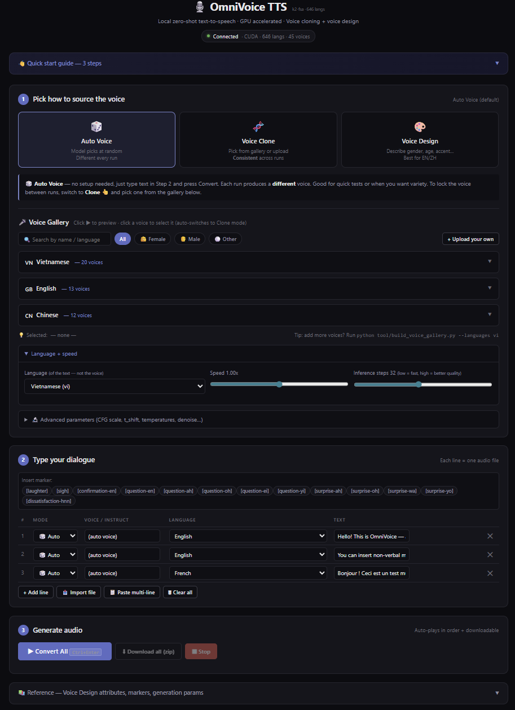

# OmniVoice TTS — Local HTTP + WebSocket Server & Web UI

> A toolkit I built **on top of** [k2-fsa's OmniVoice](https://github.com/k2-fsa/OmniVoice) that turns the zero-shot TTS engine into a local HTTP + WebSocket server with a feature-rich browser client. Everything in this section lives in [`tool/`](tool/) and is **not part of the upstream project**.

<p align="center">
  
</p>

---

## ✨ Highlights

- 🚀 **Interactive launcher** — `start_omnivoice_server.bat` shows a numbered menu (GPU + ASR / GPU only / CPU / custom port / advanced) and starts the server in seconds.
- ⚡ **Sub-second startup after first run** — `HF_HUB_OFFLINE=1` skips network checks; cached model loads in 3–5 s.
- 🌍 **646 languages** — every language OmniVoice supports is exposed in the UI dropdown, with popular ones surfaced first.
- 🎭 **Three generation modes per line** — switch between **Auto Voice**, **Voice Clone** (from gallery or upload), and **Voice Design** (gender × age × pitch × accent × dialect) row by row.
- 🎙️ **Pre-built Voice Gallery** — `build_voice_gallery.py` ships curated voice packs you can clone consistently. Includes 9 English design presets, 8 Chinese presets (5 demographic + 3 dialects), and 20 Vietnamese voices via cross-lingual cloning (10 female + 10 male, child → elderly).
- 🎯 **Auto-grouped voice browser** — voices are organized by language, then by gender (Female / Male / Other), sorted by age and pitch. Filter buttons + search bar + ▶ preview button on every voice.
- 🧬 **Cross-lingual voice synthesis** — generate controlled female/male/age/pitch voices for any of the 646 languages by passing a Chinese-language Voice Design through cross-lingual cloning.
- 🔬 **Every generation parameter exposed** — `num_step`, `guidance_scale`, `t_shift`, `position_temperature`, `class_temperature`, `layer_penalty_factor`, `denoise`, `preprocess_prompt`, `postprocess_output`, `audio_chunk_duration`, `audio_chunk_threshold`, `speed`, `duration` — all surfaced as sliders / inputs.
- 🎵 **13 non-verbal markers + pinyin/CMU phoneme overrides** — toolbar buttons insert `[laughter]`, `[sigh]`, `[question-en]`, etc. directly into the cursor position.
- 📥 **Bulk import** — load dialogue from `.xlsx`, `.csv`, `.txt`, or markdown tables; quick-prefix syntax `voice|lang: text` auto-fills mode and language.
- 📦 **Per-line audio + zip export** — convert N lines, get N `.wav` files plus an `omnivoice_YYYY-MM-DD.zip` bundle.
- 🔌 **Open HTTP + WebSocket API** — single port (8765) serves the web page, voice profile CRUD, and TTS WebSocket. Drop-in client examples for Browser, Chrome MV3 extension, Node.js, Python.
- 👤 **Voice profile manager** — upload your own 3–10 s reference audio via the UI. Files are saved to `tool/voice_prompts/` as `<name>.wav` + `<name>.json` and survive across sessions.

---

## 📁 What's in `tool/`

| File / Folder | Description |
|---|---|
| [`ws_omnivoice_server.py`](tool/ws_omnivoice_server.py) | aiohttp-based server. Loads OmniVoice once on startup, exposes HTTP routes for the static web page + voice profile CRUD, and a WebSocket route for streaming TTS. Auto-detects CUDA / MPS / CPU. Inference is serialised behind an `asyncio.Lock` to avoid GPU contention. |
| [`omnivoice_web.html`](tool/omnivoice_web.html) | Standalone single-page client. Three-step layout (pick voice → write text → generate), a Voice Gallery with gender/age grouping + ▶ preview on every voice, a live `instruct →` preview for Voice Design, and a multi-line dialogue table where each row can override mode/voice/language. No build step. |
| [`build_voice_gallery.py`](tool/build_voice_gallery.py) | Pre-builds the curated voice gallery. For EN/ZH it runs the native Voice Design pack; for other languages it does **cross-lingual design cloning** (controlled English/Chinese reference → cloned to the target language) plus a random pack auto-classified by median F0 (`librosa.yin`). All output is saved as ready-to-clone profiles. |
| [`start_omnivoice_server.bat`](tool/start_omnivoice_server.bat) | Interactive Windows launcher with a numbered menu (`[1]` GPU+ASR, `[2]` GPU only, `[3]` CPU, `[4]` custom port, `[5]` advanced). Sets `HF_HUB_OFFLINE=1` and `TRANSFORMERS_OFFLINE=1` so subsequent boots are 3–5 s. Skips the menu if args are passed directly. |
| [`WEBSOCKET_API.md`](tool/WEBSOCKET_API.md) | Full protocol spec covering all 3 modes, every generation parameter, voice profile HTTP CRUD, and ready-to-paste examples for vanilla JS, Chrome MV3 (with offscreen audio playback), Node.js, and Python. |
| [`voice_prompts/`](tool/voice_prompts/) | The voice gallery directory. Each profile is `<name>.wav` (audio) + `<name>.json` (`{"ref_text", "language", "note", "tags"}`). Pre-populated with 45 curated voices after a one-time `build_voice_gallery.py` run. |
| [`samples/`](tool/samples/) | Ready-to-import dialogue samples in `.csv`, `.md` (markdown table), and `.txt` (with `voice\|lang: text` prefix shorthand). |

---

## 🚀 Quick Start (Windows)

**1. Install OmniVoice** — see [Upstream Setup](#-upstream-setup) below. Only needed once.

**2. (Optional but recommended) Pre-build the voice gallery:**

```bat
cd tool
python build_voice_gallery.py --languages vi,en,zh --xlingual --xlingual-via zh
```

This generates **45 ready-to-clone voices** (9 EN design + 4 EN random + 8 ZH design + 4 ZH random + 20 VI cross-lingual = 45 profiles) in about **6–7 minutes** on a GTX 1660 SUPER. RTX 30/40 series finishes in under a minute.

**3. Start the server:**

```bat
cd tool
start_omnivoice_server.bat
```

A menu appears — pick `[1]` for GPU + Whisper (default), `[2]` for GPU without Whisper (saves 1.5 GB VRAM), or `[3]` for CPU. The server listens on `http://127.0.0.1:8765`.

**4. Open the web UI:**

Browse to **<http://127.0.0.1:8765/>**. The page connects automatically over WebSocket on the same port.

> **Don't open the HTML file directly via `file://`** — relative API paths get blocked by the browser. The page falls back to `http://127.0.0.1:8765` if you do, but going through the server is cleaner.

---

## 🌐 Web UI Features (`omnivoice_web.html`)

A self-contained single-page app, served by the local server. Layout follows a clear **3-step workflow**:

### Step 1 — Pick how to source the voice

Three mode tabs, each with an inline banner explaining when to use it:

| Mode | What you provide | Result |
|---|---|---|
| 🎲 **Auto Voice** | Just text | Random voice each run, different every time. Good for variety / quick tests. |
| 🧬 **Voice Clone** | Pick from gallery, or upload your own audio | Cloned voice. **Consistent** across runs using the same profile. |
| 🎨 **Voice Design** | Describe gender, age, pitch, accent, dialect | Voice matching the description. Best for English / Chinese; other languages may be unstable — use Clone with `xl_*` profiles instead. |

### Voice Gallery (always visible below the mode tabs)

- **Auto-grouped** by language (with country flag emoji), then by gender (👩 Female / 👨 Male / ⚪ Other), sorted within each gender by age (child → elderly) then pitch (low → high).
- Each voice is a tile showing an emoji ✨ for age × gender, the short name, and a descriptive note (e.g. *"Female · Young · Bright (青年女高音)"*).
- **▶ button** on every tile streams the reference audio for instant preview.
- **Click the tile** to select it as the default voice — the page automatically switches the mode tab to **Clone**.
- **Filter buttons** (All / Female / Male / Other) and a **search box** narrow the list by name, language, or note.
- **+ Upload your own** opens a modal where you can save a 3–10 s reference recording (Whisper auto-transcribes if `--no-asr` was not set).

### Voice Design panel

- One dropdown per category — **Gender · Age · Pitch · Style · English Accent · Chinese Dialect** — pulled live from the server's `/api/info`.
- **Live `instruct →` preview** updates as you change dropdowns so you can see exactly what the model receives.
- **Free-text override** (`Custom instruct`) lets you pass arbitrary attribute strings that bypass the dropdowns.

### Step 2 — Type your dialogue

- Multi-line table, one row per audio file.
- **Per-line override**: each row has its own Mode / Voice (or Instruct) / Language selector — perfect for two-speaker dialogues, multi-language announcements, or characters with distinct voices.
- **Marker toolbar** with one button per non-verbal marker (`[laughter]` `[sigh]` `[question-en]` `[question-ah]` `[surprise-oh]` `[dissatisfaction-hnn]` etc.). Clicking a button inserts the marker at the current cursor position.
- **Quick keyboard flow**: `Enter` adds a new line below; `Backspace` on an empty line deletes it.

### Step 3 — Generate audio

- **Convert All** (`Ctrl+Enter`) renders the whole queue, plays each result back automatically in order, and shows real-time progress like `🎵 Processing 3 / 5… [clone] Hello world…`.
- **Per-line audio player** with individual `⬇ Save` button (`01_clone_alice_Hello.wav` etc.).
- **⬇ Download all (zip)** — bundles every result into `omnivoice_YYYY-MM-DD.zip`.
- **⏹ Stop** — halts mid-batch and cancels playback immediately.

### Bulk import & paste shortcuts

| Action | How |
|---|---|
| **Paste multi-line** | Click `📋 Paste multi-line`. Each line becomes a row. Supports `vi: Hello world` (lang prefix) and `gallery_vi_xl_female_young: Hello world` (voice prefix → auto-Clone). |
| **Import file** | Click `📥 Import file`. Supports `.xlsx` (via SheetJS), `.csv`, `.md` markdown tables, and plain `.txt`. Column auto-detection (`voice` / `lang` / `text` / `mode`). |

### Connection + onboarding

- Live status pill (green = connected · yellow = busy · red = disconnected) with auto-reconnect.
- Dismissible onboarding panel with the 3-step walkthrough — once closed it stays collapsed via `localStorage`.

---

## 🖥️ Server Features (`ws_omnivoice_server.py`)

### Single port, two protocols

The server uses [aiohttp](https://docs.aiohttp.org) to expose both HTTP and WebSocket on **the same port (8765)**:

| Route | Purpose |
|---|---|
| `GET /` | Serves `omnivoice_web.html` (no caching). |
| `GET /api/info` | Server capabilities — list of 646 languages, voice profiles, voice-design attribute catalogue, generation defaults, non-verbal markers. |
| `GET /api/voices` | List saved voice profiles. |
| `POST /api/voices` | Upload a new profile (multipart: `name`, `ref_text`, `language`, `note`, `audio`). |
| `DELETE /api/voices/<name>` | Remove a profile. |
| `GET /api/voices/<name>/audio` | Stream the original reference WAV (used by the gallery's preview button). |
| `WS /ws` | TTS WebSocket. |

### Three modes, all gen params

The WebSocket request schema accepts every parameter the underlying `model.generate()` exposes:

```json
{
  "request_id": 42,
  "text":   "Hello world",
  "lang":   "Vietnamese",
  "mode":   "clone",
  "voice":  "gallery_vi_xl_female_young",
  "instruct": null,
  "num_step": 32,
  "guidance_scale": 2.0,
  "t_shift": 0.1,
  "layer_penalty_factor": 5.0,
  "position_temperature": 5.0,
  "class_temperature": 0.0,
  "denoise": true,
  "preprocess_prompt": true,
  "postprocess_output": true,
  "speed": 1.0,
  "duration": null,
  "audio_chunk_duration": 15.0,
  "audio_chunk_threshold": 30.0
}
```

For each request the server replies with two paired frames:
1. JSON `audio_meta` — `{ type, request_id, text, duration, latency_ms, sample_rate, size, mode, language }`.
2. Binary frame — a complete WAV (16-bit PCM mono, 24 kHz).

### Concurrency & stability

- **One-at-a-time inference** behind an `asyncio.Lock` — keeps GPU memory predictable and avoids OOM on small cards.
- `request_id` field is echoed back so multiple in-flight requests can be matched correctly.
- **Disconnect-safe**: if a client drops mid-inference the server discards its result and keeps serving others.
- `--no-asr` flag skips loading Whisper (saves ~1.5 GB VRAM); when off, voice profiles can be uploaded without `ref_text` because Whisper auto-transcribes.

### CLI

```bat
python ws_omnivoice_server.py [--port N] [--ip 127.0.0.1] [--device cuda|mps|cpu] [--cpu] [--dtype float16|float32|bfloat16] [--no-asr] [--asr-model openai/whisper-large-v3-turbo] [--model k2-fsa/OmniVoice]
```

The `start_omnivoice_server.bat` wrapper provides an interactive menu for the most common flag combinations.

---

## 🎙️ Voice Gallery & `build_voice_gallery.py`

OmniVoice is **zero-shot** — it has no fixed voice catalogue out of the box. Every generation in Auto mode produces a different random voice. To give you a curated, browsable, *reproducible* set of voices, `build_voice_gallery.py` pre-generates a gallery you can use just like a traditional preset library.

### Three preset packs

| Pack | Languages | How it works |
|---|---|---|
| **Native design** | EN, ZH | Voice Design with native-language attributes (`female, young adult, british accent`, `女, 青年, 高音调`, `四川话`, …). Deterministic and well-trained. |
| **Cross-lingual design** | Any non-EN/ZH (e.g. `vi`, `ja`, `ko`, `fr`) | Step 1: generate a controlled reference in the source language (default: Chinese). Step 2: cross-lingually clone to the target language. Step 3: save the target-language audio as the gallery profile. Yields named voices like `gallery_vi_xl_female_young` with controlled gender × age × pitch — at the cost of a slight source-language accent. |
| **Random pack** | Any | Calls Auto Voice N times, then auto-classifies each output by median F0 (`librosa.yin`) into Female / Male / Neutral and renames profiles to `<lang>_<gender>_NN` sorted by pitch. |

### Pre-baked Vietnamese pack

Running `--xlingual --xlingual-via zh` for Vietnamese yields **20 profiles** (10 female + 10 male) covering every age × pitch combination:

```
gallery_vi_xl_female_child         gallery_vi_xl_male_child
gallery_vi_xl_female_teen          gallery_vi_xl_male_teen
gallery_vi_xl_female_young_high    gallery_vi_xl_male_young_high
gallery_vi_xl_female_young         gallery_vi_xl_male_young
gallery_vi_xl_female_young_vhigh   gallery_vi_xl_male_young_low
gallery_vi_xl_female_middle        gallery_vi_xl_male_middle
gallery_vi_xl_female_middle_low    gallery_vi_xl_male_middle_low
gallery_vi_xl_female_elderly       gallery_vi_xl_male_middle_vlow
gallery_vi_xl_female_elderly_deep  gallery_vi_xl_male_elderly
gallery_vi_xl_female_whisper       gallery_vi_xl_male_elderly_deep
```

### Common usage

```bat
:: Defaults: VI random pack + EN design pack + ZH design pack
python build_voice_gallery.py

:: Vietnamese-focused: 20 named voices + 16 random
python build_voice_gallery.py --languages vi --xlingual --xlingual-via zh --random-voices 16

:: Many languages
python build_voice_gallery.py --languages vi,en,zh,ja,ko,fr,de,es,it,ru --random-voices 8 --xlingual

:: Skip everything that already exists
python build_voice_gallery.py --skip-existing
```

| Flag | Meaning |
|---|---|
| `--languages` | Comma-separated language codes (default `vi,en,zh`). |
| `--random-voices N` | Number of random samples per language (default 4). |
| `--xlingual` | Build a cross-lingual design pack for non-EN/ZH languages. |
| `--xlingual-via {en,zh}` | Source language for the cross-lingual pack. `zh` (default) gives 20 entries with reliable gender/age control; `en` gives 8 entries. |
| `--num-step N` | Diffusion steps for generation (default 24). Lower = faster, lower quality. |
| `--no-design` / `--no-random` | Skip respective pack. |
| `--skip-existing` | Don't regenerate profiles already on disk. |
| `--device` / `--dtype` / `--cpu` | Same as the server. |

---

## 🔌 HTTP + WebSocket API (at a glance)

**Connect:** `ws://127.0.0.1:8765/ws`

**Handshake (server → client, on connect):**
```json
{
  "status": "connected",
  "device": "cuda",
  "sample_rate": 24000,
  "modes": ["auto", "clone", "design"],
  "languages": [{"name": "English", "id": "en"}, /* … 646 entries … */],
  "voices":    [{"name": "gallery_vi_xl_female_young", "ref_text": "…", "language": "Vietnamese", "note": "Female · Young · Neutral"}, /* … */],
  "voice_design": {"gender": {/* … */}, "age": {/* … */}, /* … */},
  "nonverbal_markers": ["[laughter]", "[sigh]", /* … 13 markers … */],
  "gen_params": {"num_step": {"default": 32, "min": 4, "max": 64, "step": 1}, /* … */}
}
```

**Request (client → server):**
```json
{
  "text":   "Hello world",
  "lang":   "Vietnamese",
  "mode":   "clone",
  "voice":  "gallery_vi_xl_female_young"
}
```

**Reply:** JSON `audio_meta` frame followed by a binary WAV frame.

**Voice profile HTTP routes:** `GET /api/voices`, `POST /api/voices` (multipart upload), `DELETE /api/voices/<n>`, `GET /api/voices/<n>/audio` (stream original WAV).

Full spec with Chrome MV3 / Node / Python examples → [`tool/WEBSOCKET_API.md`](tool/WEBSOCKET_API.md).

---

## 📦 Upstream Setup

Install OmniVoice itself (the server uses the same Python environment):

```bash
# 1. Install PyTorch matching your hardware
pip install torch==2.8.0+cu128 torchaudio==2.8.0+cu128 \
    --extra-index-url https://download.pytorch.org/whl/cu128

# 2. Install OmniVoice (editable for development)
cd OmniVoice
pip install -e .

# 3. Install the extra runtime deps the tool/ uses
pip install aiohttp websockets
```

After that, `start_omnivoice_server.bat` handles the rest. First launch downloads ~4.6 GB of models from HuggingFace (3.1 GB OmniVoice + 1.5 GB Whisper-large-v3-turbo) into `~/.cache/huggingface/hub`. Subsequent launches load from cache in 3–5 s thanks to `HF_HUB_OFFLINE=1`.

> **HuggingFace mirror tip**: if downloads are slow, set `HF_ENDPOINT=https://hf-mirror.com` before the first launch.

### VRAM requirements

| Setup | VRAM | Notes |
|---|---|---|
| GPU + Whisper (default) | ~4 GB | Recommended. Allows uploading voice profiles without `ref_text`. |
| GPU only (`--no-asr`) | ~2.5 GB | For ≤6 GB cards. `ref_text` becomes required when uploading voices. |
| CPU (`--cpu`) | 0 GB | 5–10× slower than GPU. Works on any machine. |

---

## About Upstream OmniVoice

[**OmniVoice**](https://github.com/k2-fsa/OmniVoice) by the [k2-fsa](https://github.com/k2-fsa) Next-gen Kaldi team (Xiaomi AI Lab) is a state-of-the-art massively multilingual zero-shot TTS model supporting over **600 languages**. Its diffusion language-model architecture delivers RTF as low as 0.025 (40× faster than real-time on capable hardware) while supporting voice cloning, voice design, non-verbal expression markers, and inline pinyin/CMU pronunciation overrides.

- **Models & demo:** [Hugging Face — k2-fsa/OmniVoice](https://huggingface.co/k2-fsa/OmniVoice) · [Interactive Demo](https://huggingface.co/spaces/k2-fsa/OmniVoice)
- **Paper:** [arXiv:2604.00688](https://arxiv.org/abs/2604.00688)
- **Demo page:** <https://zhu-han.github.io/omnivoice>
- **Colab notebook:** [docs/OmniVoice.ipynb](docs/OmniVoice.ipynb)
- **Upstream README:** see the [original repository](https://github.com/k2-fsa/OmniVoice) for architecture details, training pipeline, evaluation scripts, paper citation, and per-language documentation.

---

## Citation

If you use OmniVoice in your research, please cite the upstream paper:

```bibtex
@article{zhu2026omnivoice,
      title={OmniVoice: Towards Omnilingual Zero-Shot Text-to-Speech with Diffusion Language Models},
      author={Zhu, Han and Ye, Lingxuan and Kang, Wei and Yao, Zengwei and Guo, Liyong and Kuang, Fangjun and Han, Zhifeng and Zhuang, Weiji and Lin, Long and Povey, Daniel},
      journal={arXiv preprint arXiv:2604.00688},
      year={2026}
}
```

---

## License

- Sample code (including `tool/`): **Apache-2.0** — see [`LICENSE`](LICENSE).
- Model weights: see the [model license on Hugging Face](https://huggingface.co/k2-fsa/OmniVoice).

---

## Disclaimer

Users are strictly prohibited from using this model for unauthorized voice cloning, voice impersonation, fraud, scams, or any other illegal or unethical activities. All users shall ensure full compliance with applicable local laws, regulations, and ethical standards. The developers assume no liability for any misuse of this model and advocate for responsible AI development and use, encouraging the community to uphold safety and ethical principles in AI research and applications.

Upstream © 2026 Xiaomi Corp. (k2-fsa). Additions in `tool/` © their respective author.
